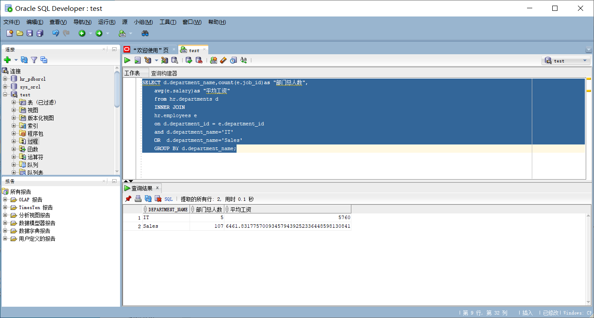
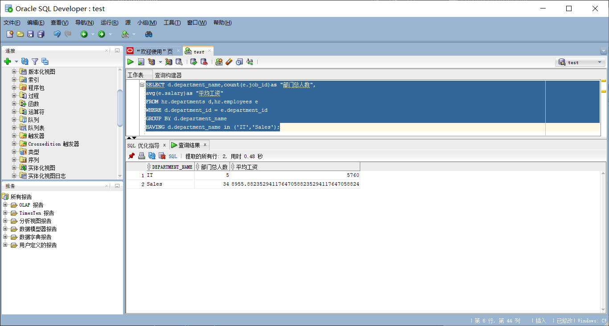
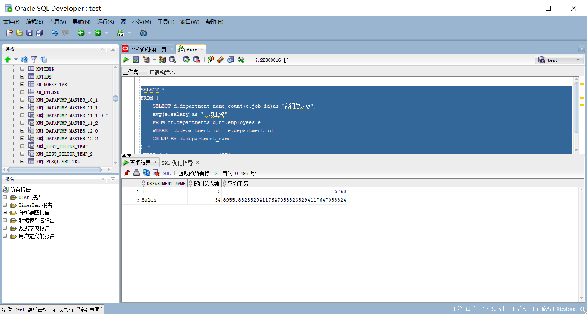

### 实验1：SQL语句的执行计划分析与优化指导

姓名：刘鹏  
班级：2018级软件工程2班 
学号：201810112220 

* 实验目的
  
分析SQL执行计划，执行SQL语句的优化指导。理解分析SQL语句的执行计划的重要作用。

* 实验内容
  
对Oracle12c中的HR人力资源管理系统中的表进行查询与分析。
首先运行和分析教材中的样例：本训练任务目的是查询两个部门('IT'和'Sales')的部门总人数和平均工资，以下两个查询的结果是一样的。但效率不相同。
设计自己的查询语句，并作相应的分析，查询语句不能太简单。
教材中的查询语句

1. 查询1：

```mysql
set autotrace on

SELECT d.department_name,count(e.job_id)as "部门总人数",
avg(e.salary)as "平均工资"
from hr.departments d,hr.employees e
where d.department_id = e.department_id
and d.department_name in ('IT','Sales')
GROUP BY d.department_name;
```

`查询结果：`



`优化建议：`

查找结果：在执行计划的行 ID 4 处发现开销很大的笛卡尔积操作。
建议：考虑从此语句中移去断开连接的表或视图, 或者添加引用它的联接条件。	
原理：应尽可能避免笛卡尔积操作, 因为它的开销很大, 并且会产生大量数据。

1. 查询2
```mysql
set autotrace on

SELECT d.department_name,count(e.job_id)as "部门总人数",
avg(e.salary)as "平均工资"
FROM hr.departments d,hr.employees e
WHERE d.department_id = e.department_id
GROUP BY d.department_name
HAVING d.department_name in ('IT','Sales');
```
`查询结果：`



`优化建议：`
无
3. 自己设计的sql语句
   ```
    SELECT * 
    FROM (
        SELECT d.department_name,count(e.job_id)as "部门总人数",
        avg(e.salary)as "平均工资"
        FROM hr.departments d,hr.employees e
        WHERE  d.department_id = e.department_id
        GROUP BY d.department_name
    ) d
    WHERE d.department_name = 'IT'
    OR d.department_name = 'Sales'
   ```
`运行结果：`



`优化建议：`

查找结果：通过创建一个或多个索引可以改进此语句的执行计划。	
建议：考虑运行可以改进物理方案设计的访问指导或者创建推荐的索引。	
原理：创建推荐的索引可以显著地改进此语句的执行计划。但是, 使用典型的 SQL 工作量运行 "访问指导" 可能比单个语句更可取。通过这种方法可以获得全面的索引建议案, 包括计算索引维护的开销和附加的空间消耗。
   
实验参考地址
Oracle地址：202.115.82.8 用户名：system ， 密码123， 数据库名称：pdborcl，端口号：1521
用户hr默认没有统计权限，运行上述命令时要报错：
无法收集统计信息, 请确保用户具有正确的访问权限。
统计信息功能要求向用户授予 v_$sesstat, v_$statname 和 v_$session 的选择权限。
